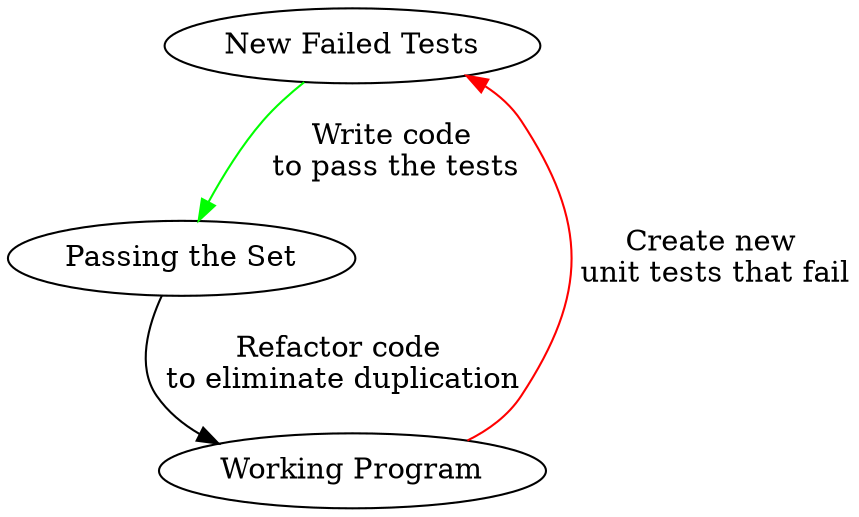

# CAB302 | 2022 Year 1 Semester 1

Written by Brook Jeynes (Chooky) using the QUT course content and many other sources
<br>

<h1>Table of Contents</h1>
<ul>
	<li><a href="#CAB302">CAB302: Software Development</a></li>
	<ul>
		<li>Intro to the topic | Tips for the unit</li>
		<li><a href="#week1">Week 1</a>: Introduction to Java and OOP</li>
		<li><a href="#week2">Week 2</a>: Object Oriented Programming</li>
		<li><a href="#week3">Week 3</a>: Collections, Agile and Source Control</li>
		<li><a href="#week4">Week 4</a>: Exceptions and Unit Testing</li>
		<li><a href="#week5">Week 5</a>: Graphical User Interfaces</li>
		<li><a href="#week6">Week 6</a>: Databases</li>
		<li><a href="#week7">Week 7</a>: Software Patterns and Refactoring</li>
		<li><a href="#week8">Week 8</a>: Test-Driven Development</li>
		<li><a href="#week9">Week 9</a>: Collections and Generics</li>
		<li><a href="#week10">Week 10</a>: The Integrated Build</li>
		<li><a href="#week11">Week 11</a>: Threads</li>
		<li><a href="#week12">Week 12</a>: DevOps</li>
		<li><a href="#week13">Week 13</a>: </li>
	</ul>
</ul>

<hr /> <br />

<h1 id="CAB302">CAB302: Software Development</h1>
<p>This unit teaches you how to work effectively in a team to develop large-scale software systems. It includes principles of teamwork, modern software development methodologies and tools that are needed when working in a team on a large project.</p>

<br />

<h2 id="week1">Week 1: Introduction to Java and OOP</h2>

### What is Java?

Java is an object-oriented programming language developed by Oracle. It was designed to be an architecture-neutral, portable, fast, secure and network-aware language. On most computers there exists something called a JVM - a Java Virtual Machine - which acts as a simulator for Java programs. The JVM reads in bytecode and produces code that the machine can read using JIT, just-in-time, compilation. The JVM allows portability in 2 main ways

1. It ensures that the same bytecode can be run on multiple operating systems
2. It ensures that primitive type encodings are consistent across different computers
   As well as helping with Java portability the JVM conveniently handles memory allocation and deallocation for us. However, this does come with some tradeoffs with memory and speed.

### Java Concepts

- Class: Base unit - consists of fields and methods (.java file)
- Program: A set of classes, one with a `main` method
- Package: A set of classes with a shared scope typically providing a single coherent `service`. These are used to organise classes and avoid name collisions. Packages correspond to directories in the class-path
- Bytecode: A compiled Java class (.class file) - This is what's read by the JVM
- Java Archive: A file containing sever Java bytecode classes (.jar file). Can also be run by the JVM and is typically a more convenient way of packaging software for distribution

### Java Hello World

Let's take a look at a small "Hello, world!" program in Java to get an understanding of the layout.

```java
public class Main {
	public static void main(String[] args) {
		System.out.println("Hello, world!");
	}
}
```

The first line in the example above states that we're working in the `Main` class of the program. Classes are just a way we can organise and split certain parts of our program.

Line 2 is our `main` function, the `main` function is special as it indicates the entry point of our program. Here we can see some extra keywords along with it such as `static` and `void`. These are identifier keywords we can use to change how our functions behave. The `static` keyword indicates that this method can be called without the need to create an object tied to it. The `void` keyword indicates our return type of the function, `void` represents that this function will not be returning anything. The final part of this line is the arguments the main function takes, `String[] args`. Here we tell the main function to take in a string array called `args` that will contain any command line arguments we pass to the program when we run it.

Line 3 simply prints the text "Hello, world!" to the command line using the `System.out.println()` method. Let it also be noted that at the end of each statement in Java we must include a semicolon `;`.

### Declarations

To declare variables in Java we first need to state the datatype and then the name. From there on we can decide whether to give it a value upon creation or not.

```java
// Numerical values
byte a = 15;                  // 1 byte
short b = 400;                // 2 bytes
int c = 67;                   // 4 bytes
long d;                       // 8 bytes
float z = 5.3234f;            // 4 bytes
double y = 3.14;              // 8 bytes

// Alphanumerical values
char myLetter = 'D';          // Single character, must use ''
String myText = "Hello";      // Collection of characters, must use ""

// Booleans
boolean myTrue = true;
boolean myFalse = false;

// Arrays
int[] intArray = {1, 5, 3, 6};
String[] stringArray = {"Hello", "World", "!"};

// Wrappers | One for each primitive type
Integer intObject = 4;
Character charObject = 'g';
```

### Conditional Statements

`if` statements allow us to run conditional code, statements of code only run if a certain condition is met. There are 3 types of if statements, if statement, if-else statement, and cascading if statements.

```java
int myCredits = 156;

final int graduate = 288;
final int second = 192;
final int first = 96;

if (myCredits >= graduate) {
	System.out.println("Bachelor of IT Graduate");
} else if (myCredits >= second) {
	System.out.println("Third Year Student");
} else if (myCredits >= first) {
	System.out.println("Second Year Student");
} else {
	System.out.println("First Year Student");
}
```

### For and For-Each Loops

A `for` loop is a type of iteration that will continue to loop through a block of code a specified amount of times.

```java
for (int a = 0; a <= 10; a++) {
	System.out.println(a);
}
```

In the example above we declare a variable called `count` inside of the `for` loop statement, tell it to keep looping everything inside of its body until `count` is less than or equal to 10, and finally after every loop +1 to `count`.

We can also use for-each loops which instead of looping of the indices, will loop over the objects. We use this when we don't care so much about the position of the item, just the item itself.

```java
int[] intArray = {1, 2, 30, 4, 5, 6, 7};

for (int i : intArray) {
	System.out.println(i);
}
```

### While and Do-While Loops

A `while` loop is a type of iteration that will continue to loop through a block of code as long as the specified condition is true. It first checks the condition, then if `true` will run whats inside the body. When working with `while` loops it's important to be careful not to create infinite loops (loops without any break condition).

```java
int count = 1;

while (count < 10) {
	System.out.println(count);
	count++;
}
```

Unlike with a `while` statement which checks the condition first then runs the code block a `do{} while` conditions run the body first, then check if the condition is `true`.

```java
int count = 0;

do {
	count++;
	System.out.println(count);
} while (count < 10);
```

### Comments

```java
// This is a single line comment

/*
This is
a multi-line
comment
*/


// Special comments for functions and classes
// Used by Java and the IDE to create documentation
// Will show up when hovering over function name or params

/**
 * Main function
 * @param args Command line arguments
 */
public static void main(String[] args) {

}
```

### User Input

There are a couple ways we can get user input from the terminal in Java but it is recommended we use the `Scanner` library. To be able to use the `Scanner` library in our code we first need to import it using `import java.util.Scanner;`. Once it's imported we create a `Scanner` object to gain access to its methods and use the `.nextLine()` method to read in a `String` from the user.

```java
import java.util.Scanner;

public class Main {
	public static void main(String[] args) {
		Scanner keyboard = new Scanner(System.in);

		System.out.print("What is your name: ");

		String name = keyboard.nextLine();

		System.out.printf("Your name is %s", name);
	}
}
```

### Object Oriented Programming

OOP is a way of programming where we rely on this concept of using objects and classes. We use these concepts to structure our program into easy to digest, reusable pieces of code blueprints, often referred to as a class, which can then be used to create individual instances, these are our objects. We do this because although functionality may change the types of objects we based our design off the actual code will hardly change at all. For example, planes, passengers, crew and so on are most likely to exist far into the future, they might change how bookings are handled or expand into other industries but the original set of classes largely will still exist. Therefor object-oriented designs are much more likely to stand the test of time.

### Abstraction

Abstraction is the process of hiding all unnecessary details from the user allowing them to focus simply on how to use an object and not focus on how it works. For example, a class full of students each may have a different height, weight and gender however by performing abstraction we can call them all students. Abstraction is supported in OOP by giving names to classes and by making every object created know to belong to a particular class.

### Classes

Classes are essentially the blueprints, or building blocks, for an object. The class defines the details needed for an object but are not the objects themselves. Classes are built of 3 main components, the name of the class, the attributes that describe the object and the behaviours of the objects. It is to be noted that you may only have 1 class per file in Java and the file must have the same name as the class name.

```java
// Point.java
public class Point {
	int x;
	int y;

	// Class constructor:
	// - Same name as the class
	// - Doesn't have a return type
	// Generally uses the keyword public
	public Point(int x, int y) {
		this.x = x;
		this.y = y;
	}
}

// Main.java
class Main {
	public static void main(String[] args) {
		Point p = new Point(3, 5);
	}
}
```

### Properties

- Public: Member can be reached from anywhere, same class or other
- Private: Can only be reached by members of the same class

Private variables are only accessible from items within the same class however sometimes we may need to access these variables elsewhere in our program, we can access them using properties.

```java
// Point.java
public class Point {
	private int x;
	private int y;

	public Point(int x, int y) {
		this.x = x;
		this.y = y;
	}

	// Getter
	public int getX() {
		return x;
	}

	// Setter
	public void setX(int x) {
		this.x = x;
	}
}

// Main.java
class Main {
	public static void main(String[] args) {
		Point p = new Point(3, 5);

		System.out.println(p.getX());
		p.setX(5);
	}
}
```

Here we can see that we create a variable called `x` and a property `getX` to go along with it. The `getX` method returns the value of the variable while the `setX` method assigns the new value to the variable (value being a reference to the value we're trying to use)

### Overloading

Overloading is a way to write multiple versions of a method with the same name that allow the input of different data types. Overload methods must have a different set of parameters to the original method being overridden. For example, if our method takes in 2 ints, none of our overloads can take in 2 ints. It's also important to remember that the return value of our method is ignored.

```java
// Person.java
class Person {
	int age;

	public Person(int age) {
		this.age = age;
	}

	void IncrementAge(int increment) {
		this.age = this.age + increment;
	}

	void IncrementAge() {
		this.age++;
	}
}

// Main.java
class Main {
	public static void main(String[] args) {
		Person jeff = new Person(25);   // age: 25

		jeff.IncrementAge();            // age: 26
		jeff.IncrementAge(3);           // age: 29
	}
}
```

### Overriding

Overriding allows us to create a method with the same name in the parent and child class without creating errors. We do this by giving the method in the child class the `@Override` tag. In the example below the `Animal` class has a method called `makeSound()` with its own implementation while the `Dog` class also contains the method `makeSound()` however its implementation overrides the `Animal` classes implementation.

```java
// Animal.java
class Animal {
	public Animal() {}

	public void makeSound() {
		System.out.println("Animal sound");
	};
}

// Dog.java
class Dog extends Animal {
	public Dog() {}

	@Override
	public void makeSound() {
		System.out.println("Woof");
	}
}
```

### Static Classes

A static class is a class that can hold only static methods while non-static classes can hold static and non-static methods. We use static classes when we know we wont need to use any non-static methods or variables.

### Static Methods

A static method is a method that can be called without the need of creating an object to call it on. Instead we call the method on the class itself.

```java
// User.java
class User {
	// ...

	public String[] getCredentials() {
		// ...
	}

	public static String hashPassword() {
		// ...
	}
}

// Main.java
class Main {
	public static void main(String[] args) {
		// Non-static method example
		// Here a User object has to be created to call the method on
		User newuser = new User();
		newuser.getCredentials();

		// Static method example
		// Here we can call the method directly on the class User
		User.hashPassword();
	}
}
```

### Pass by Value vs Pass by Reference

In Java there are two ways we can pass something through a function either by value or reference.

| Item passed        | Passing Method             | Affect on Item                                                                         |
| ------------------ | -------------------------- | -------------------------------------------------------------------------------------- |
| Primitive Types    | Always passed by value     | Changes made to said item in a method have no effect on the item outside of the method |
| Objects and Arrays | Always passed by reference | Changes made to said item in a method affect the item outside of the method            |

Below we can see an example of this in action:

```java
public class Main {
	public class Main {
		public static void changeA(int a) {
			a = 5;
		}

		public static void changeB(int[] b) {
			b[0] = 4;
		}

		public static void printArray(int[] b) {
			for (int x : b) {
				System.out.printf("%d ", x);
			}
		}

		public static void main(String[] args) {
			int a = 4;
			changeA(a);
			System.out.println(a); // 4

			int[] b = {1, 2, 3};
			changeB(b);
			printArray(b); // {4, 2, 3}
		}
	}
}
```

### Packages

Packages in Java are used to group related classes together similar to how a folder in a file directory groups related applications and files. Packages also help us avoid name conflicts and write easier to maintain code.

<br />

<h2 id="week2">Week 2: Object Oriented Programming</h2>

### Abstraction

Abstraction is the process of hiding all unnecessary details from the user allowing them to focus simply on how to use an object and not focus on how it works. For example, a class full of students each may have a different height, weight and gender however by performing abstraction we can call them all students and ignore these extra properties.

### Encapsulation

Encapsulation on the other hand is the idea of combining or bundling all data and methods that work on an object into a single unit. This is used to hide the internal data of an object from the outside world (all code outside of the object). This is generally done to make sure that other sections of the code that shouldn't be able to change or modify the data don't accidentally change the data. Java supports this concept through the use of the private keyword, getter/setter methods and private helped methods.

### Inheritance

Inheritance is the process of building classes off other classes. This allows us to create new classes while being able to use all the previous methods and fields from the class being extended. This helps remove redundancy and allows us to build new features without having to worry about the backbones of the class. We call the base class a superclass and the extended class a subclass. We use the method `super()` to invoke the constructor of the superclass and the keyword `super.method()` to invoke a method from the superclass.

```java
// Animal.java
class Animal {
	private String name;

	public Animal(String name) {
		this.name = name;
	}

	public void displayName() {
		System.out.printf("My name is %s", this.name);
	}
}

// Dog.java
class Dog extends Animal {
	private String breed;

	public Dog(String name, String breed) {
		super(name);
		this.breed = breed;
	}
}

// Main.java
class Main {
	public static void main(String[] args) {
		Dog myDog = new Dog("Tess", "Border Collie");

		// Has access to methods from parent class
		myDog.displayName() // "My name is Tess"
	}
}
```

### Abstract Classes

Abstract classes are used to define a base class and is restricted in the sense that it cannot be used to create objects (to access it, it must be inherited from another class). An abstract class can have both abstract and regular methods defined inside. The subclass inheriting from the abstract class must implement all abstract methods but does not have to implement non-abstract methods.

```java
// Animal.java
abstract class Animal {
	public Animal() {}

	// Abstract methods have no body or implementation
	// The body is defined in the subclasses
	public abstract void makeSound();
}

// Dog.java
class Dog extends Animal {
	public Dog() {}

	public void makeSound() {
		System.out.println("Woof");
	}
}

// Main.java
class Main {
	public static void main(String[] args) {
		Dog myDog = new Dog("Tess", "Border Collie");

		myDog.makeSound() // "Woof"
	}
}
```

### Interfaces

An interface is essentially the same as an abstract class however it only allows abstract methods and cannot contain any fields. An interface also cannot be initialised, due to this reason an interface cannot contain a constructor. All methods in an interface, by default, are abstract and public therefor these keywords are not required when declaring methods. When we inherit from an interface instead of using the `extends` keyword we use the `implements` keyword. A distinct comparison between interface inheritance and class inheritance is that a class may only inherit from one other class while a class can inherit multiple interfaces.

```java
// IGraphics.java
interface IGraphics {
	// No constructor as an interface can't be initialised

	// abstract and public keywords ommited
	double area();
	double perimeter();
}

// Rectangle.java
class Rectangle implements IGraphics {
	double length;
	double width;

	public Rectangle(double length, double width) {
		this.length = length;
		this.width = width;
	}

	public double area() {
		return this.length * this.width;
	}

	public double perimeter() {
		return (this.length + this.width) * 2;
	}
}

// Circle.java
class Circle implements IGraphics {
	double radius;
	final double PI = 3.14;

	public Circle(double radius) {
		this.radius = radius;
	}

	public double area() {
		return PI * Math.pow(radius, 2);
	}

	public double perimeter() {
		return 2 * PI * radius;
	}
}

// Main.java
class Main {
	public static void main(String[] args) {
		IGraphics rectangle = new Rectangle(10, 15);
		IGraphics circle = new Circle(10);
	}
}
```

### Polymorphism

Polymorphism means to have many forms and occurs in programming when we have classes that relate to each other through the process of inheritance. An example of this could be:

- Shape: Triangle, Square, Circle
- Person: Student, Teacher, Child
- Laws: Common Law, Statutory Law, Civil War
- Family Relationships: Sibling, Spouse, Parent

With polymorphism we talk about a child class (or a sub class) and its corresponding parents class or (super class). E.g. Rectangle is the sub class or the child class while Shape is its parent class or its super class, or base class. It's important to remember that objects are instances of classes meaning there would only be objects of class Rectangle or Circle, not Shape (since Shape is an abstract class).

```java
// Shape.java
abstract class Shape {
	public Shape() {}

	abstract double getArea();
	abstract double getPerimeter();
}

class Rectangle extends Shape {
	double length;
	double width;

	public Rectangle(double length, double width) {
		// ...
	}

	public double getArea() {
		// ...
	}

	public double getPerimeter() {
		// ...
	}
}

class Circle extends Shape {
	double radius;
	final double PI = 3.14;

	public Circle(double radius) {
		// ...
	}

	public double getArea() {
		// ...
	}

	public double getPerimeter() {
		// ...
	}
}

// Main.java
class Main {
	public static void main(String[] args) {
		Rectangle rectangle = new Rectangle(10, 15);
		Circle circle = new Circle(10);

		// Because Rectangle and Circle both implement Shape
		// They can both be classified as a Shape type
		// This is called dynamic binding
		Shape[] myShapes = {rectangle, circle};

		for (Shape shape: myShapes) {
			shape.getArea();
			shape.getPerimeter();
		}
	}
}
```

### Enum (Enumerators)

An enum is a special data type, similar to a class type, that allows a single variable to represent a collection of named constants. We generally use enums when we know all of the possible values at compile time, such as menu items, command-line flags, and so on. Enums can also contain methods inside of their declaration that can be used on the Enum object.

```java
class Main {
	public enum Direction {
		NORTH, EAST, SOUTH, WEST;
	}

	public enum Day {
		MONDAY (0), TUESDAY (1), WEDNESDAY (2), THURSDAY (3), FRIDAY (4),
			SATURDAY (5), SUNDAY (6);

		private int day;

		Day(int day) {
			this.day = day;
		}

		void printDay() {
			System.out.printf("Today is day %d of the week: %s\n", day, toString());
		}
	}

	public static void main(String[] args) {
		Direction currentDirection = Direction.NORTH;
		Day currentDay = Day.MONDAY;

		for (Day currentDay : Day) {
			currentDay.printDay();
		}

		// Output:
		// Today is day 0 of the week: MONDAY
		// Today is day 1 of the week: TUESDAY
		// Today is day 2 of the week: WEDNESDAY
		// Today is day 3 of the week: THURSDAY
		// Today is day 4 of the week: FRIDAY
		// Today is day 5 of the week: SATURDAY
		// Today is day 6 of the week: SUNDAY
	}
}
```

<br />

<h2 id="week3">Week 3: Collections, Agile and Source Control</h2>

### Documentation

Documentation is essential when it comes to working on large-scale applications in large teams of people. It allows other developers to have an easier time understanding how the code you write works and helps other members on your team use the code. However, keeping documentation updated has been a problem for some time as there is more pressure on the developer to improve the code and fix bugs rather than update documentation. To help fix this problem many IDEs have come with a feature to automatically generate documentation from the written code. An example of this is the `javadoc` command provided in the Java JDK.

Javadoc is a command that can be run that will, using special comments written and following the programs class structure, produce a HTML document containing documentation and information about the code written. Javadoc processes annotations between `/** ... */` comments that proceed method and class declarations.

- `@author`: The class' author
- `@version`: The class version
- `@param`: Information about the methods parameters
- `@return`: Information about the methods return value
- `@throws`: Information about which exceptions the method may throw
- `@deprecated`: Used to alert that the method or class is outdated
- `@see`: Used to point to another relevant method or class

Here is an example of how Javadoc may work:

```java
/**
 * Given two Strings representing a users first and last name, combine
 * the two and return a single String containing their first and last
 * separated by a space.
 *
 * @param firstName users first name
 * @param lastName users last name
 * @return String containing first and last name combined separated by a space
 */
public String combineName(String firstName, String secondName) {
	// ...
}
```

### Collections

A Collection is a compound data type that allows the grouping of multiple elements all consisting of the same data type. Collections allow us to operate on multiple common objects/elements at a time instead of individually working on them. We create a collection in Java using `Collection<E> collectionName = new Collection<E>();` where `E` is the data type the collection will contain. It's important to remember that an Array is different to a Collection in Java. The main difference between the two is that a collection will grow and shrink at runtime while an array will stay at a fixed size. It's also important to note that a collection can only store objects while Arrays can store primitive types and objects.

### Sets

Sets fall under the `Collections<E>` interface and are groups of elements which contain no duplicates. Sets are usually also unordered however we can specify them to be ordered if need be. Sets are implemented in Java by three main classes:

1. HashSet (unordered)
2. TreeSet (ordered)
3. LinkedHashSet (insertion-ordered)

Sets include a variety of useful methods we can apply to them such as `add()`, `remove()`, `isEmpty()`, `contains()` and many more.

Here are a few example of sets:

```java
import java.util.Collection;
import java.util.TreeSet;
import java.util.HashSet;

public class Main {

	public static void printCollection(Collection x) {
		for (Object y : x) {
			System.out.println(y);
		}
	}

	public static void main(String[] args) {
		String[] words = {"hello", "cake", "dog", "sushi", "tree", "best",
												"dog", "sushi", "world"};

		// Will
		//  - Store no duplicates
		//  - Sort and store in alphabetical order
		TreeSet<String> treeSetExample = new TreeSet<>();

		for (String word : words) {
			treeSetExample.add(word);
		}

		printCollection(treeSetExample);

		// Will
		//  - Store no duplicates
		//  - Sort and store in hash table
		HashSet<String> hashSetExample = new HashSet<>();

		for (String word : words) {
			hashSetExample.add(word);
		}

		printCollection(hashSetExample);
	}
}
```

### Lists

Lists fall under the `Collections<E>` interface and are ordered groups of elements which are indexable. Lists are also special in the way that you can insert or remove elements from any index position. Due to lists being indexable we can run them through a for loop and, using `i` as our counter, retrieve values by index `i`. Lists are implemented in Java by four main classes:

1. ArrayList
2. LinkedList
3. Stack
4. Vector (however this is deprecated)

Sets include a variety of useful methods we can apply to them such as `add()`, `remove()`, `get()`, `set()`, `indexOf()`, `sort()`, `reverse()` and many more.

Here are a few example of sets:

```java
import java.util.Collection;
import java.util.ArrayList;
import java.util.Scanner;

public class Main {

	public static void printCollection(Collection x) {
		for (Object y : x) {
			System.out.println(y);
		}
	}

	public static void main(String[] args) {
		Scanner keyboard = new Scanner(System.in);

		// Will
		//  - Store duplicates
		//  - Store items in order of input
		ArrayList<String> listOfNames = new ArrayList<>();

		while (true) {
			System.out.print("Enter a name to store: ");
			String name = keyboard.nextLine();
			if (name.isBlank()) break;

			listOfNames.add(name);
		}

		printCollection(listOfNames);

		// ArrayLists are also indexable meaning we can retrieve values
		// based on their index position
		for (int i = 0; i < listOfNames.size(); i++) {
			System.out.println(listOfNames.get(i));
		}
	}
}
```

### Queues

Queues fall under the `Collections<E>` interface and are ordered sequences of elements. Queues are accessed via their endpoints consisting of a head (front of list: far right visually) and a tail (end of list: far left visually). Queues are implemented in Java by three main classes:

1. ArrayDeque (double ended)
2. ArrayBlockingQueue (fixed capacity)
3. PriorityQueue

Queues include a variety of useful methods we can apply to them such as `add()`, `peek()`, `remove()` and many more.

### Maps

Maps fall under the `Collections<E>` interface and are collections of keys and values, these are also called dictionaries in other languages. Maps are essentially lookup tables that associate unique keys with values. Maps are implemented in Java by three main classes:

1. HashMap (unordered)
2. TreeMap (ordered by key)
3. LinkedHashMap (insertion-ordered)

Maps include a variety of useful methods we can apply to them such as `put()`, `get()`, `containsKey()`, `containsValue()`, `remove()` and many more.

### Collection Specifications and Implementations

There are so many different types of collections as we've seen, how do we know which one to use? Well we use a:

- Set: If we don't want duplicates
- Map: If we have key-value pairs
- List: If we want to preserve the order of elements
- Queue: If we want to preserve order and only need the head or tail element at any given time

And so how do these collections fair up with run-time and efficiency?

- Fixed-sized arrays and hash tables can be indexed in constant time ( O(1) )
- Sorted arrays and trees can be searched in logarithmic time ( O(log n) )
- Linked lists can be accessed in linear time ( O(n) )

### Iteration over Collections

Retrieving and looping through individual elements in an ArrayList can seem easy and non-trivial as ArrayLists support indexing. This concept may seem a little harder however to implement for things like Maps and Sets due to their inability to support native indexing. To get around this we can of course use a simple for-each loop and loop over each element that way, but what if we need to do something a little bit more complicated? It's because of this reason that the Collections library implements an `iterator()` method. Using `hasNext()`, `next()`, and many more in conjunction with each other we can simulate this iteration of objects in these collections.

```java
HashSet<String> studentNames;
Iterator<String> iteration = studentNames.iterator();

// .hasNext() returns true when there is another element to loop over
// and false others
while(iteration.hasNext()) {
	// .next() will return the current item in the collection and then
	// move onto the next item
	System.out.println(iteration.next());
}
```

### Waterfall and Agile Development

Waterfall development is a design pattern that flows down through all steps like a waterfall. In this development methodology each step is worked through, top to bottom, with each phase being completely finished before moving onto the next.

Waterfall Development:

- First capture all the user **requirements**
- Then **design** the entire system
- Then **implement** the entire system
- Then **test** the entire system
- Then **release** the entire system to the customer

Agile development on the other hand focuses on repeating the waterfall development cycle for each feature working in 'sprints' that focus more on iterative and incremental development. Iterative and incremental development is the process of starting and finishing small chunks of the given problem at any one time. When given a huge project to work on it can become hard to understand everything initially. To combat this we start by understanding small parts of the system, developing just that part, implementing and testing it and ensuring that part is working before proceeding to the next. Developing in this iterative and incremental manner allows us to easily break down the problem and helps us avoid making sub-optimal design choices early on based on limited knowledge and understanding. Another benefit to this design process is that we have sections of working code at the end of each iteration allowing us to show managers and customers if need be but also to help us stay motivated.

### Version Control

Version control is the practice of tracking and managing all changes made to the code in a project. Version control software, like Git, store all commits (code changes) into a special database. Not only does this allow us to see how the code changes overtime but it also allows us to revert back to previous states of code in the database if we ever need to fix a bug in an earlier version or something arises in the code and we just need to revert back to a previous state. Version control software also allows for much easier development in teams of multiple developers as it allows everyone to have their own working local repository of code and, generally without issue, push that code to the global repository. This means that the global repository successfully stores everyones new changes without disruption of each other.

### Learning Git

Due to Git being so large with many commands that each do different things I simply don't have the time to go over them in this guide, especially when others have written guides on Git that are 10x better than what I could write. It's for that reason that I'm just going to link some great resources for learning Git:

- [Github Learning Lab](https://lab.github.com/)
- [Atlassian Git Tutorial](https://www.atlassian.com/git)
- The weekly content also has a nice Git pdf walkthrough

<br />

<h2 id="week4">Week 4: Exceptions and Unit Testing</h2>

### Assertions

An assertion in Java is a statement that allows us to check the correctness of an assumption. That is to say, if the program is working correctly out assertion is true and if there is an error our assertion is false. Assertions in Java are turned off by default so we need to turn them on. Inside of IntelliJ we can do this by editing our run configuration -> Modify options -> Add VM options -> and then type "-ea" (--enableassertions) inside of the new VM input box that shows up.

We can use assertions in java using the `assert` keyword and can be used in replacement to error checking print statements and allow errors to be trapped at their source. There are two ways we can create an assertion:

1. `assert boolean_expression;`
2. `assert boolean_expression : displayable_expression;`

```java
class Main {
	public static void main(String[] args) {
		int money = 15;

		assert (false);
		// Exception in thread "main" java.lang.AssertionError

		assert (false) : "Not enough money";
		// Exception in thread "main" java.lang.AssertionError: Not enough money
	}
}
```

### Exceptions

An exception is an event that happens during the runtime of your program that disrupts the flow of the program. What this means is if an exception is thrown during the execution of your program, the program will crash and throw an exception error at us. We can create exceptions using the `Exception()` object and the `throw` keyword. It's important to note that if our function is going to throw an exception we need to explicitly state that in the function declaration (this also extends to any function calling said function). However, if our exception throw is contained inside of a `try-catch` block then we don't need to state our function throws an exception.

```java
class Main {
	public static void exceptionMethod() throws Exception {
		throw new Exception();
	}

	public static void main(String[] args) throws Exception {
		exceptionMethod();
		// Exception in thread "main" java.lang.Exception
	}
}
```

So we know how we can create exceptions but how can we actually handle them? Java allows us to handle these exceptions using something called a `try-catch` block. This works similar to as you'd expect, the code inside of the `try{}` block will be run and if an exception is thrown during this process the code in our `catch{}` block will then be run. Once the code in the `catch{}` block has been evaluated then the code after our `try-catch` statement will run as normal instead of our program crashing.

```java
class Main {
	public static void exceptionMethod() {
		try {
			System.out.println("This section will be run");
			throw new Exception();
			// cannot write code below an Exception throw
		} catch (Exception e) {
			System.out.println("An exception has been caught");
		}

		System.out.println("This code will also run");
	}

	public static void main(String[] args) {
		exceptionMethod();
		// This section will be run
		// An exception has been caught
		// This code will also run
	}
}
```

### Unit Testing

Unit testing is a testing technique in which individual modules, or methods in smaller applications, are tested to determine if there are any problems or issues that could arise. The main aim of unit testing is to isolate each individual part of the program and identify, analyse and fix any errors. In this unit we'll use JUnit to create automated tests for our programs. There are generally two strategies for designing unit tests, back box testing and glass box testing.

### Black Box Testing

In black box testing we create test cases based around the specifications of the programs needs. We give the system a wide range of inputs and observe the outputs making sure they match up to what they should be. There are two typical types of tests a set of standard tests which cover a variety of normal test cases and inputs and a set of boundary tests where we enter values that may not be expected or are extremes of the system.

### Glass Box Testing

In glass box testing we create test cases based around the actual code of the program. There are generally three ways we can cover all bases when it comes to glass box testing:

1. Statement coverage: In this test we make sure every statement is executed at least once
2. Branch coverage: In this test we make sure each condition in a branch is evaluated at least once
3. Path coverage: In this test we make sure every control-flow path is executed at least once

### JUnit (5.4)

JUnit is a unit testing framework for Java programs that we can use to generate automatic unit tests for us. The first step to creating a unit test is to create an empty class to hold all of our unit tests. Our tests inside of our unit test class are created as parameterless void methods preceded with special annotations (much like our function comments). Some common annotations are such:

- `@Test`: Tells the method it is going to be a unit test
- `@BeforeAll`: This test is run before any other unit tests are executed
- `@AfterAll`: This test is run before after all other unit tests are executed

Within our test unit methods we run tests by calling JUnits `Assert` class. Once imported, JUnit's Assert class will give us access to a variety of assert methods such as:

- `assertEquals()`
- `assertArrayEquals()`
- `assertTrue()` / `assertFalse()`
- `assertNull()` / `assertNotNull()`
- `assertThrows()`

Here is a small example of a unit test in Java:

```java
// UnitTest.java
import static org.junit.jupiter.api.Assertions.*;
import org.junit.jupiter.api.*;

public class UnitTest {
	Sum sum;

	@BeforeEach
	public void SumConstruction() {
		sum = new Sum();
	}

	@Test
	public void TestAddition() {
		int testAnswer = sum.doSum(5, 5);
		int expectedAnswer = 10;
		assertEquals(expectedAnswer, testAnswer);
	}

	@Test
	public void TestNegativeAddition() {
		int testAnswer = sum.doSum(-5, -10);
		int expectedAnswer = -15;
		assertEquals(expectedAnswer, testAnswer);
	}
}
```

<br />

<h2 id="week5">Week 5: Graphical User Interfaces</h2>

### AWT

The very first GUI toolkit developed for Java was AWT, The Abstract Windowing Toolkit. AWT created GUI widgets by calling the native widget equivalent depending on the system being run. This was nice as you knew if you wanted to create a button on one system, any other system running your code would have a button equivalent. This was also bad in a sense that the widget library would be small and would not allow for any customisability.

### Swing

Java's solution to the limiting aspect of AWT was the creation of Swing. Swing is a GUI toolkit based around everything being a component. In Swing the only native code components we have access to are the native components used to create the GUI frame or canvas. We then fill this native frame with components written in Java which are just rendered to the native frame. What this allowed developers to do was create custom components which would look the exact same no matter what operating system the program was run on.

Our Swing GUI is made up of 3 layers:

1. Top level containers: These components serve as the container for all of our other components. These can appear anywhere on the desktop and are made up of content panes which we add our other components to.
2. Intermediate containers: These components serve as containers for atomic components. These help us provide a layout to our GUI allowing us to create sections which we can then put atomic components into.
3. Atomic components: These are components that are standalone and don't contain any other components. These components are the components that the user will generally be interacting with the most. These consist of buttons, labels, drop-downs and more.

Here is an example of how Swing looks incorporating these 3 layers:

```Java
// MyGui.java
import javax.swing.*;
import java.awt.*;

public class MyGui {
	private final JFrame frame;

	public MyGui(int width, int height, String title) {
		// Top level container code

		// Create a new frame with a title
		this.frame = new JFrame(title);

		// Set the default close operation of the GUI
		this.frame.setDefaultCloseOperation(JFrame.EXIT_ON_CLOSE);

		// Create a new menu bar and some menu bar items
		JMenuBar menuBar = new JMenuBar();
		JMenu fileMenu = new JMenu("File");
		JMenu editMenu = new JMenu("Edit");

		// Create sub-items for our menu item
		fileMenu.add("Open");
		fileMenu.add("Save");
		fileMenu.add("Exit");
		editMenu.add("Cut");
		editMenu.add("Copy");
		editMenu.add("Paste");

		// Add the sub-items to the menu item
		menuBar.add(fileMenu);
		menuBar.add(editMenu);

		// Add menu item to the menu
		frame.setJMenuBar(menuBar);

		// Set the size of the GUI
		this.frame.setPreferredSize(new Dimension(width, height));


		// Intermediate level container code

		JTabbedPane tabPanel = new JTabbedPane();

		// Create new panel with all elements inside left aligned
		JPanel panel = new JPanel(new FlowLayout(FlowLayout.LEFT));

		JPanel themes = new JPanel();

		JPanel name = new JPanel();
		JPanel email = new JPanel();
		JPanel phoneNum = new JPanel();

		tabPanel.add("User", panel);
		tabPanel.add("Themes", themes);

		// Create an empty border to replicate panel padding
		panel.setBorder(BorderFactory.createEmptyBorder(10, 20, 10, 20));


		// Atomic components

		name.add(new JLabel("Name"));
		name.add(new JTextField("", 15));

		email.add(new JLabel("Email"));
		email.add(new JTextField("", 15));

		phoneNum.add(new JLabel("Phone Number"));
		phoneNum.add(new JTextField("", 15));

		panel.add(name);
		panel.add(email);
		panel.add(phoneNum);

		themes.add(new JButton("Update Theme"));

		frame.getContentPane().add(tabPanel);


		// Top level container code

		// Pack all components onto the GUI
		this.frame.pack();

		// Set location of the GUI relative to the center of the screen
		this.frame.setLocationRelativeTo(null);
	}

	public void show() {
		// Make the GUI visible on the screen
		this.frame.setVisible(true);
	}
}

// Main.java
public class Main {
	public static void main(String[] args) {
		javax.swing.SwingUtilities.invokeLater(() -> {
			// Create a new GUI thats 300x300 with the title "Test GUI"
			MyGui frame = new MyGui(300, 300, "Test GUI");
			// Show the GUI we just created
		  frame.show();
		});
	}
}
```

### Event Listeners

In Swing we can add actions to button presses and mouse movements using events. If an event is recorded its action is passed down to the component most directly affected. That is to say that:

- Keyboard events will go to the component currently in focus
- Mouse events will go to the component directly under the mouse

In the below example we have a button that has an event listener and a mouse adapter even tied to it:

```Java
// ButtonListener.java
import javax.swing.*;
import java.awt.*;
import java.awt.event.ActionEvent;
import java.awt.event.ActionListener;
import java.awt.event.MouseAdapter;
import java.awt.event.MouseEvent;

public class ButtonListener extends MouseAdapter implements ActionListener {
	@Override
	public void actionPerformed(ActionEvent e) {
		JOptionPane.showMessageDialog((Component) e.getSource(), "Pressed a button");
	}

	@Override
	public void mouseEntered(MouseEvent e) {
		super.mouseEntered(e);
		System.out.println("The mouse moved over me");
	}
}

// MyGui.java
import javax.swing.*;
import java.awt.*;

public class MyGui {
	private final JFrame frame;

	public MyGui(int width, int height, String title) {
		this.frame = new JFrame(title);
		this.frame.setDefaultCloseOperation(JFrame.EXIT_ON_CLOSE);
		this.frame.setPreferredSize(new Dimension(width, height));

		JPanel panel = new JPanel(new FlowLayout(FlowLayout.LEFT));

		JButton button = new JButton("Save");

		button.addActionListener(new ButtonListener());
		button.addMouseListener(new ButtonListener());

		/*
		Can also be done as such without the need of a new class

		button.addMouseListener(new MouseAdapter() {
			@Override public void mouseEntered(MouseEvent e) {
				super.mouseEntered(e);
				System.out.println("The mouse moved over me");
			}
		});

		button.addActionListener((e) -> {
			JOptionPane.showMessageDialog((Component) e.getSource(), "Pressed a button"));
		}
		*/

		panel.setBorder(BorderFactory.createEmptyBorder(10, 20, 10, 20));

		panel.add(button);

		frame.getContentPane().add(tabPanel);

		this.frame.pack();
		this.frame.setLocationRelativeTo(null);
	}

	public void show() {
		this.frame.setVisible(true);
	}
}

// Main.java
public class Main {
	public static void main(String[] args) {
		javax.swing.SwingUtilities.invokeLater(() -> {
			MyGui frame = new MyGui(300, 300, "Test GUI");
		  frame.show();
		});
	}
}
```

### Swing Layouts

Swing comes with a layout manager which can be used to help position components in our layouts. Each container inside of your GUI can have its own self managed layout without disturbing any external or internal layouts. There are a few layouts that Swing provides to us:

- FlowLayout: This layout is the default used inside of panels. It simply places components from top left to bottom right.
- BorderLayout: This layout splits the panel into 5 separate sections (NORTH, EAST, SOUTH, WEST, CENTER).
- GridLayout: In this layout all components are organised into a grid structure and are all assigned the same size.
- BoxLayout: A BoxLayout is at its core a FlowLayout but with much more flexibility. in a BoxLayout components are stacked into the frame either vertically or horizontally.
- GridBagLayout: A GridBagLayout is like an extended version of a GridLayout. All components are placed in a grid like format however individual component sizes can be altered.

### Error Handling in Swing

When an exception is thrown in a Swing application the exception won't actually crash the program. This is because Swing works using event handlers that seperate themselves from the rest of the main code. This is bad because if we have a fatal exception in our Swing application, the GUI itself won't actually crash. We can fix this just like we would with any command line application, through the use of try-catch statements.

```Java
// ...

JButton button = new JButton("Click Me!");
button.addActionListener(e -> {
	try {
		System.out.println(3/0);
	} catch (Exception x) {
		JOptionPane.showMessageDialog(null, x.getMessage())
	}
});

button.setToolTipText("This button throws a division by 0 exception");

// ...
```

### Threads

In its simplest form a thread is a lightweight process. Java allows for the use of multithreading allowing 1 or more lightweight processes to be run concurrent of each other. This is extremely useful as it allows the user to interact and activate multiple GUI processes without the application freezing up. For example, if the user presses the print button in Word, we don't want the program freezing and the user not being able to do anything until the printing process has finished.

Multithreading can however be dangerous at times. Imagine if we have a variable that 2 concurrent processes are manipulating, what state is that variable actually going to contain? It's because of this that it's important to make sure we write thread-safe code. This can be complicated and difficult at times when writing GUI applications and it's because of this that Java and Swing have created a solution to this problem through the use of an EventDispatch thread. We can use this simply by containing all our code into a `SwingUtilities.invokeLater()` event.

```Java
// MyGui.java
import javax.swing.*;
import java.awt.*;

public class MyGui {
	private final JFrame frame;

	public MyGui(int width, int height, String title) {
		this.frame = new JFrame(title);
		this.frame.setDefaultCloseOperation(JFrame.EXIT_ON_CLOSE);
		this.frame.setPreferredSize(new Dimension(width, height));
		this.frame.setLocationRelativeTo(null);
	}

	public void show() {
		this.frame.setVisible(true);
	}
}

// Main.java
public class Main {
	public static void main(String[] args) {
		javax.swing.SwingUtilities.invokeLater(() -> {
			MyGui frame = new MyGui(300, 300, "Test GUI");
		  frame.show();
		});
	}
}
```

<br />

<h2 id="week6">Week 6: Databases</h2>

### Database

A database is an organised collection of related data. These collections are stored in tables which consist of rows (records) and columns (attributes). We can form relationships between tables using primary and foreign keys.

Example database:

- Name (Pk) -> {Transferrer, Transferee} (Fk)

| Name (Primary key) | Address           | Bank Balance |
| ------------------ | ----------------- | ------------ |
| Alice              | 12 Fake St        | $10000       |
| John               | 38 Test Dr        | $8000        |
| Bob                | 20 Imaginary Blvd | $20000       |

| Transferrer (Foreign key) | Transferee (Foreign key) | Amount | Date  |
| ------------------------- | ------------------------ | ------ | ----- |
| Alice                     | Bob                      | $200   | 02-05 |
| Bob                       | John                     | $350   | 05-23 |
| John                      | Alice                    | $475   | 01-04 |

### SQL

SQL, or Structured Query Language, is the standard language used for interacting with a database. Here are a few example commands from the SQL language:

- SELECT: Extract data from a database
- UPDATE: Update data from a database
- DELETE: Delete data from a database
- INSERT INTO: Insert data into a database
- CREATE DATABASE: Create a new database
- ALTER DATABASE: Alter an existing database
- CREATE TABLE: Create a new table
- ALTER TABLE: Alter an existing table

### Connections

So how do we go about actually connecting a database up in Java? We can use the `Connection` interface to provide us with a handful of useful connection methods such as `.getConnection()`. We can then also use the `DriverManager` class to provide our application with some basic driver management. Let's see an example of this in use:

```java
public class JDBCConnection6 {
	// Create a new connection object
	private Connection connection

	public JDBCConnection6() {
		try {
			// Database 'cab302' is created already
			String url = "jdbc:mysql://localhost:3306/cab302";
			String username = "admin";
			String password = "admin";

			// Get a connection to the database
			connection = DriveManager.getConnection(url, username, password);
		} catch (SQLException sqle) {
			System.err.println(sqle);
		}
	}

	// After editing a database it is good practice to close that connection
	public static void closeConnection() {
		this.connection.close();
	}

	public static void main(String[] args) {
		JDBCConnection6 myConnection = new JDBCConnection6();
		// Do stuff
		myConnection.closeConnection();
	}
}
```

### Statements

Once a `Connection` is established we can then use it to start executing `Statements`.

```Java
// imports
import java.sql.Connection;
import java.sql.DriverManager;
import java.sql.SQLException;
import java.sql.Statement;

public class Main {
	public static void main(String[] args) throws SQLException {
		String url = "jdbc:mysql://localhost:3306/cab302";
		String username = "admin";
		String password = "admin";

		Connection connection = DriveManager.getConnection(url, username, password);

		// Create a new statement
		Statement statement = connection.createStatement();
		// Execute a statement
		statement.execute("INSERT INTO names VALUES('John Doe', 22);");
		statement.execute("DELETE FROM names WHERE name = 'John Doe';");

		// Execute a statement and return a ResultSet
		ResultSet state = statement.executeQuery("SELECT * FROM names");

		// Execute an update statement and return number of rows update
		int rows = statement.executeUpdate("UPDATE names SET age=21 WHERE name='John Doe'");

		statement.close();
		connection.close();
	}
}
```

### Prepared Statements

Prepared statements are pre-compiled SQL statements at object time rather than at execution time. We use the '?' symbol to indicate value parameters that are to be filled later in the program.

```Java
// imports
import java.sql.Connection;
import java.sql.DriverManager;
import java.sql.SQLException;
import java.sql.Statement;

public class Main {
	public static void main(String[] args) throws SQLException {
		String url = "jdbc:mysql://localhost:3306/cab302";
		String username = "admin";
		String password = "admin";

		Connection connection = DriveManager.getConnection(url, username, password);

		// Create a PreparedStatement
		PreparedStatement statement = connection.prepareStatement("UPDATE names SET age=? WHERE name=?");

		// Reset parameters before editing
		statement.clearParameters();

		// Set value where arg 1 is the query position (indexed from 1)
		// and arg 2 is the updated value
		statement.setInt(1, 25);
		statement.setString(2, "John Doe");

		int rows = statement.executeUpdate();

		statement.close();
		connection.close();
	}
}
```

### Batch Processing

While prepared statements can improve access times, if there are hundreds of thousands of insert statements executed, there is a lock and release carried out in the database for each insert. We can use `.addBatch()` and `.executeBatch()` methods to add groups of related SQL statements together and execute them with one call.

```Java
// imports
import java.sql.Connection;
import java.sql.DriverManager;
import java.sql.SQLException;
import java.sql.Statement;

public class Main {
	public static void main(String[] args) throws SQLException {
		String url = "jdbc:mysql://localhost:3306/cab302";
		String username = "admin";
		String password = "admin";

		Connection connection = DriveManager.getConnection(url, username, password);

		PreparedStatement statement = connection.prepareStatement("UPDATE names SET age=? WHERE name=?");

		statement.clearParameters();

		statement.setInt(1, 25);
		statement.setString(2, "John Doe");
		statement.addBatch();

		statement.setInt(1, 22);
		statement.setString(2, "Jane Smith");
		statement.addBatch();

		statement.setInt(1, 29);
		statement.setString(2, "Steven Wonder");
		statement.addBatch();

		// Execute all statements in the Batch, returns an array of rows affects
		int[] updateCounts = statement.executeBatch(); // sample output, [1, 1, 1]

		statement.close();
		connection.close();
	}
}
```

### Transaction Processing

In some applications we may want a series of SQL statements to be grouped together to perform a transaction. That is to say, we only want this transaction to execute if we know all statements inside of it will pass, if one fails we want to act like any data modified through the transaction never happened. In transactions we use the keyword `commit` to commit our changes to our database.

At the start of our transaction we first use `.setAutoCommit(false)` on our Connection object to prevent part of the transaction from being automatically committed to the database. We then use `commit()` to explicitly carry out any outstanding statements. If a problem occurs through our transaction we can use `rollback()` to rollback any changes in our database.

We can create save points in our database and, in conjunction with `rollback()`, rollback our database state to a previous save.

```Java
// imports
import java.sql.Connection;
import java.sql.DriverManager;
import java.sql.SQLException;
import java.sql.Statement;

public class Main {
	public static void main(String[] args) throws SQLException {
		String url = "jdbc:mysql://localhost:3306/cab302";
		String username = "admin";
		String password = "admin";

		Connection connection = DriveManager.getConnection(url, username, password);

		connection.setAutoCommit(false);

		Statement statement = connection.createStatement();
		statement.execute("INSERT INTO names VALUES('John Doe', 23);");
		statement.execute("INSERT INTO names VALUES('Jane Smith', 25);");

		// Create a database save point
		Savepoint saved = connection.setSavePoint("After John and Jane");

		statement.execute("INSERT INTO names VALUES('Bob Brown', 22);");

		// Rollback database to saved point
		connection.rollback(saved);
		connection.commit() // "Bob Brown" wont be in database

		statement.close();
		connection.close();
	}
}
```

### Result Set

A `ResultSet` is used to store the results of an SQL query. It's stored as a two-dimensional table of all rows in the database that matched the requested query. To get the data from the `ResultSet` we need to use the method template `.getx(y)` where `x` represents the data type and `y` represents either the column number (indexed from 1) or the column name. We can also use update methods to update the ResultSet. We do this using `.updatex()` where `x` represents the data type and then using `.updateRow()` to write the updates into the database.

```Java
// imports
import java.sql.Connection;
import java.sql.DriverManager;
import java.sql.SQLException;
import java.sql.Statement;

public class Main {
	public static void main(String[] args) throws SQLException {
		String url = "jdbc:mysql://localhost:3306/cab302";
		String username = "admin";
		String password = "admin";

		Connection connection = DriveManager.getConnection(url, username, password);

		Statement statement = connection.createStatement(
														ResultSet.TYPE_SCROLL_INSENSITIVE,
															ResultSet.CONCUR_UPDATABLE);

		ResultSet resultSet = statement.executeQuery("SELECT * FROM names;");

		// Moves the curser to the next item in the set
		// Returns true if there is an item to .next() to and false otherwise
		while (resultSet.next()) {
			String name = resultSet.getString(1);
			int age = resultSet.getInt(2);
			System.out.printf("%s : %d", name, age);
		}

		resultSet.close();
		statement.close();
		connection.close();
	}
}
```

### Large Objects

<br />

<h2 id="week7">Week 7: Software Patterns and Refactoring</h2>

### Software Pattern

A software pattern is a reusable solution to a common problem in the current scope. These are non-complex, domain-specific designs that capture the design intent but not the full details. There are hundreds of design patterns but let's look at 3 important common ones:

1. Factory Method
   - Where we define an interface to help us create multiple similar objects
2. Singleton
   - This class has only one instance and we provide a global point of access to it
3. Observer
   - Where we create a one-to-many dependency between objects. When one of our objects change, all the dependents are notified and updated accordingly

### Factory Method

In the factory method design pattern we define an interface to help us create multiple similar objects. These objects are created without exposing the creation logic. For example:

```Java
public interface Pet {
	public void speak();
}

public class Dog implements Pet {
	@Override
	public void speak() {
		System.out.println("Woof");
	}
}

public class Cat implements Pet {
	@Override
	public void speak() {
		System.out.println("Meow");
	}
}

public class PetFactory {
	public static final String DOG = "DOG";
	public static final String CAT = "CAT";

	public static Pet getPet(String petType) throws PetException {
		switch(petType) {
			case DOG: return new Dog();
			case CAT: return new Cat();
			default: throw new PetException("Invalid pet type");
		}
	}
}
```

### Singleton

We use a singleton when we want to ensure that only one instance of a class is created. Using a singleton we can also provide a global point of access to our object. For example:

```java
public class Singleton {
	protected Singleton() {}

	private static class SingletonHolder {
		private final static Singleton INSTANCE = new Singleton();
	}

	public static Singleton getInstance() {
		return SingletonHolder.INSTANCE;
	}

	public static void main(String[] args) {
		Singleton s1 = getInstance();
	}
}
```

### The Observer Pattern

A common problem in programming is synchronising some state or response across a collection of object in the response of an event. In this design pattern when there are changes in the state of the subject, we can keep all observers up to date.

For example, image a weather monitoring system:

- Subject: Sensors notes changes in temperature
- Observers: Client GUIs displaying temperature
- Observers: Weather modelling systems

### Refactoring

Refactoring is the process of cleaning and improving code while still preserving the underlying behaviour. There are a few methods of refactoring that we can follow.

### Decompose Conditional

We use this method of refactoring when we have a complicated piece of code which can be extracting into self explainable functions. For example:

```java
if (data.before(SUMMER_START) || date.after(SUMMER_END)) {
	charge = quantity * _winterRate + _winterServiceCharge;
} else {
	charge = quantity + _summerRate;
}
```

Can be refactored to:

```java
if (notSummer(date)) {
	charge = winterCharge(quantity);
} else {
	charge = summerCharge(quantity);
}
```

### Extract Method

We use this method of refactoring when we have certain code fragments that can be grouped together. For example:

```java
void printOwing() {
	printBanner();
	System.out.printf("Name: %s\n", _name);
	System.out.printf("Amount: %.2f", getOutstanding());
}
```

Can be refactored to:

```java
void printDetails(double outstanding) {
	System.out.printf("Name: %s\n", _name);
	System.out.printf("Amount: %.2f", outstanding;
}

void printOwing() {
	printBanner();
	printDetails(getOutstanding());
}
```

### Encapsulate Collection

We use this method of refactoring when we want to make a returned collection read-only. For Example:

![[Pasted image 20220424154430.png]]

### Replace Error Code with an Exception

We use this method of refactoring to replace any error code with an exception throw. For example:

```java
int withdraw(int amount) {
	if (amount > _balance) {
		return -1;
	} else {
		balance = balance - amount;
		return 0;
	}
}
```

Can be refactored to:

```java
void withdraw(int amount) throws OverdrawException {
	if (amount > _balance) {
		throw new OverdrawException();
	}

	_balance = balance - amount;
}
```

### Split Loop

We use this method of refactoring to split loops that do multiple things. For example:

```java
void printValues() {
	double averageAge = 0; double totalSalary = 0;

	for (int i = 0; i < people.length; i++) {
		averageAge += people[i].age;
		totalSalary += people[i].salary;
	}

	averageAge = averageAge / people.length;
	System.out.println(averageAge);
	System.out.println(totalSalary);
}
```

Can be refactored to:

```java
void printValues() {
	double averageAge = 0;
	for (int i = 0; i < people.length; i++) {
		averageAge += people[i].age;
	}
	averageAge = averageAge / people.length;

	double totalSalary = 0;
	for (int i = 0; i < people.length; i++) {
		totalSalary += people[i].salary;
	}

	System.out.println(averageAge);
	System.out.println(totalSalary);
}
```

<br />

<h2 id="week8">Week 8: Test-Driven Development</h2>

### What is Test-Driven Development

Test-driven development is a software development methodology where:

- Work in short development iterations
- Satisfy pre-prepared test cases before moving on

In test driven development test are built and prepared based off user requirement's before any code is written. We then write the code only after the test cases are created to only pass the written tests. Once the code passes all designated test, more tests are written and the code is then extended to support them.

The Test-Driven Development mantra is "Red, Green, Refactor"



- Red: Create a small test that doesn't pass
- Green: Make the test pass in the quickest and easiest way possible (make sure not to break the previous test)
- Refactor: Rewrite the code to remove any duplication that was introduced developing the previous test

### Test-Driven Development: Rule of Thumb

- The larger the initial test suite the better the debugging
- When you receive a bug report, we write a test that exposes that bug
- A lot of the test-cases written are built around program boundaries and exceptional behaviors
- The tests we write may have to be refactored based on new user requirements
- Tests should be isolated and only test for a single thing

### Advantages of TDD

- When using TDD we have the confidence to make small and quick changes to our application
- We always have a constant state of feedback for our program
- Any change that breaks our program is generally detected immediately
- Unit testing takes the place of debugging
- Unit tests act as our documentation in a way
- Only necessary code is written and designed
- Due to the short development cycles there is always a working application to show to the client

### Disadvantages of TDD

- TDD is very difficult for programs or modules that rely heavily on user input or the environment.
- Poorly written tests will result in poorly written code

### Mocking

Sometimes when we're developing classes in TDD we need other classes or outside resources we sometimes just don't have access to or will take too long to get. This is where mock objects come in, these are classes/objects that simulate these outside resources in a quick and easy contained way.

- Dummies: Test objects which are never used but exist to satisfy syntactic requirements
- Stubs: Test objects whose methods return fixed values and support only specific test cases
- Mock: Test objects which know how they are meant to be used
- Fakes: Test objects which work but has a very limited set of functionality. We can use these for more complicated and extensive testing however these can be more complicated to setup in the beginning

Dummies Example:

```Java
public interface IDatabase {
	public void open();
	public ArrayList<String> getNames() throws Exception;
	public void close();
}

public class DatabaseDummy implements IDatabase {
	public void open() {};

	public ArrayList<String> getNames() throws Exception {
		return new ArrayList<String>();
	}

	public void close() {};
}
```

Stubs Example:

```Java
public class DatabaseStubs implements IDatabase {
	public void open() {};

	public ArrayList<String> getNames() throws Exception {
		return new ArrayList<String>();
		names.add("John");
		names.add("Mike");
		names.add("Josh");
		names.add("Lucy");
	}

	public void close() {};
}
```

Mock Example:

```java
public class DatabaseMockup implements IDatabase {
	private boolean isOpen;

	public DatabaseMockup() {
		isOpen = false;
	}

	public void open() {
		isOpen = true;
	}

	public void close() {
		isOpen = false;
	}

	// Due to this needing open() before we can run successfully we can test for a
	// certain sequence of events
	public void TestMockException() throws Exception {
		IDatabase db = new DatabaseMockup();
		// Will cause error because open() is not run
		ArrayList<String> names = db.getNames();

		for (String name : names) {
			System.out.println(name);
		}
	}
}
```

<br />

<h2 id="week9">Week 9: Collections and Generics</h2>

### Stack and Fixed Stack

A stack is a collection that has access to the methods:

- Push: Push an element to the top of the collection
- Pop: Pop an element off the top of the collection
- Peek: Peek at the top element of the collection

A fixed stack on the other hand is a collection that contains a fixed set of elements and can be either bounded (can only contain a single data type) or unbounded (can contain any data type).

Let's see an example of a fixed stack which can only hold integers:

```java
import java.util.ArrayList;

public class FixedStackInt {
	private ArrayList<Integer> contents;
	private int maxSize

	public FixedStackInt(int maxSize) {
		contents = new ArrayList<>();
		this.maxSize = maxSize;
	}

	public boolean push(int newItem) {
		if (contents.size() < maxSize) {
			contents.add(newItem);
			return true;
		} else {
			return false;
		}
	}

	public int peak() throws ArrayIndexOutOfBoundsException {
		if (!contents.isEmpty()) {
			return contents.get(contents.size() - 1);
		}

		throw new ArrayIndexOutOfBoundsException("Stack is empty");
	}

	public int pop() {
		if (!contents.isEmpty()) {
			int value = contents.get(contents.size() - 1);
			contents.remove(contents.size() - 1);
			return value;
		}

		throw new ArrayIndexOutOfBoundsException("Stack is empty");
	}
}
```

### Generics

Generics are data types that accept other data types as a parameter. All of the classes contained in the collections framework are generic. This is because the data type of the items stored in the collection are only stated when the collection is declared.

Classes and methods are able to have generic type parameters, we define such using `CollectionName<X>` where `X` refers to the data type. Bounded generic types restrict the parameter types allowed and can be specified by stating which class the allowed types extend as such `CollectionName<X extends String>`.

Let's now adjust the above FixedStackInt example to now allow generics:

```java
import java.util.ArrayList;
import java.util.AbstractCollection;

public class FixedStack<E> extend AbstractCollection<E> {
	private ArrayList<E> contents;
	private int maxSize

	public FixedStack(int maxSize) {
		contents = new ArrayList<>();
		this.maxSize = maxSize;
	}

	public boolean push(E newItem) {
		if (contents.size() < maxSize) {
			contents.add(newItem);
			return true;
		} else {
			return false;
		}
	}

	public E peak() throws ArrayIndexOutOfBoundsException {
		if (!contents.isEmpty()) {
			return contents.get(contents.size() - 1);
		}

		throw new ArrayIndexOutOfBoundsException("Stack is empty");
	}

	public E pop() {
		if (!contents.isEmpty()) {
			E value = contents.get(contents.size() - 1);
			contents.remove(contents.size() - 1);
			return value;
		}

		throw new ArrayIndexOutOfBoundsException("Stack is empty");
	}

	@Override
	public Iterator<E> iterator() {
		return contents.iterator();
	}

	@Override
	public int size() {
		return contents.size();
	}
}
```

### Designing Subtypes

When designing subtypes it's important to follow the substitution principle. The substitution principle states that subtypes should always be usable just by looking at the supertype specifications. This generally comes down to 3 main specifications:

1. All subtypes must have signature-compatible methods for all methods provided in the supertype
2. All calls to the subtypes methods must behave and act in accordance to the corresponding method in the supertype. That is to say, the subtypes implementation of a supertypes method must act with the same goal in mind.
3. The subtype must preserve all of the provable properties of the supertype.

<br />

<h2 id="week10">Week 10: The Integrated Build</h2>

### The Building Process

When we build an application we're really just referring to the process of putting the system as a whole together. Builds are based on a series of steps:

1. Edit the source code
2. Successful compilation of said source code
3. Successful unit testing at a class level
4. Integration of the object code into the application
5. Successful (system) integration testing
6. Deployment preparation

### Apache Ant

Apache Ant is a widely used, pure Java, build system that is portable and extensible. We specify our build settings in the build.xml file.

We first start off with some application:

```java
public class HelloWorld {
	public static void main(String[] args) {
		System.out.println("Hello World!");
	}
}
```

We then modify our build.xml file:

```xml
<project name="antdemo" default="all">
	<target name="all" depends="compile, run, cleanup" />
	<target name="compile">
		<javac srcdir="src" destdir="." />
	</target>

	<target name="run">
		<java classpath="." classname="HelloWorld" />
	</target>

	<target name="cleanup">
		<delete file="HelloWorld.class" />
	</target>
</project>
```

And finally we run then build command `ant` in the terminal:

```bash
[jd]~ ant
Buildfile: build.xml

compile:
	[javac] Compiling 1 source file to /Users/jd

run:
	[java] Hello World!

cleanup:
	[delete] Deleting: /Users/user/HelloWorld.class

all:

BUILD SUCCSSFUL
Total time: 1 second
[jd]~
```

### Ant Requirements

Before we begin we need to install a few things and setup some settings. The first thing we need to do is to install junit-platform-launcher. We can do this by installing Maven. We then need to make sure the junit-platform-launcher is in the classpath that has access to Ant. There are a few ways we can do this if it's not already done but the most simple way involves just moving it into Ant's directory.

### Ant Disadvantages

Although Ant is a very powerful tool it does have a few disadvantages. Ant isn't the best tool for individual development, there is a lot of setup that goes on for it and sometimes using the IDE is simply the easier and better choice. Ant can't automate the whole build process meaning that human interaction is still needed some times.

### Maven

Maven is another popular build automation and package management software for Java. Maven is configured through a Project Object Model (pom.xml) and generally requires much less configuration than Ant.

### Continuous Integration

Continuous integration is a scheduler for creating daily builds. These vary in implementation but at their core they create a new build whenever

1. There is a change to a defined repository
2. At pre-set fixed intervals

A modern CI suite still used today is Jenkins. Jenkins comes packaged with a GUI and has support for a variety of plugins. It also can be run from the command line as a service and configured via a web browser.

Another CI option is Git Hooks. Git Hooks can be configured to run scripts in response to events like commits. Git Hooks is highly customisable however it is specific to SCM provider unlike Jenkins which is more generic. Git Hooks is configured via .yml files and is run on a VM run by Github.

At the end of the day continuous integration is a great idea however the effectiveness of it depends entirely on the quality of the system integration test. GUI's, databases and other links to external systems can all limit the system in their own way.

<br />

<h2 id="week11">Week 11: Threads</h2>

### Why use Threads?

There are two main reasons as to why we want to use threads.

1. Asynchronicity: By using threads, we can perform multiple tasks at the same time without the interruption of each other. This allows tasks that usually take a long time to not disturb or interrupt the usual execution of the program.
2. Parallelism: When we put the use of multiple threads to work on a single problem, we can complete that problem much faster. As different threads work on different parts of the puzzle the ultimate problem is finished in a much quicker sense as processes can run parallel to each other.

In a single threaded application, most statement blocks block the continuation of code until they finish processing. By running that task on an alternate thread we can perform other work on the original thread in the mean time allowing our application to remain responsive and not blocked.

Threads are very useful however they are dangerous to use in some instances. Due to threads running asynchronously there opens up the chance that two threads attempt to manipulate or delete data that another thread is currently processing. Java provides a solution to this by introducing the monitor. The monitor is a control mechanism used for thread safety. When a thread enters the monitor, all other threads must wait until the occupying thread exits. This type of thread safety is given to us by Java through the use of the `synchronized` keyword.

### Java Classes and Interfaces for Threading

1. `java.lang.Thread` - A class that provides us the ability to create and run threads
2. `java.lang.Runnable` - The interface that thread classes implement

### Service Threads

A service thread is a thread that exists in the background providing services to the application through some form of looping action. The server thread listens using a daemon thread on each port and when a request comes in:

1. Creates/calls another thread to do the work
2. The worker thread then terminates naturally
3. The daemon thread continues to work on the background monitoring the ports ready to start the process again

### Thread Safety

We can say a variable is thread safe, if it belongs to only one thread. Instance variables are specific to each instance of a class and, depending on the program structure, is inherently thread safe. Class variables on the other are defined statically being shared between all classes. Due to there having the chance of having more than one copy these are not considered to be thread safe. When dealing with multi-thread programs we must make sure they are thread safe. If we mismanage threads we can end up with a variety of issues such as:

- Race conditions
- Deadlock: In a deadlock a thread is waiting for a resource held by another blocked thread. In an instance like this there is no progress possible.
- Livelock: In a livelock a thread acts in response to another thread, this thread makes no progress but it also isn't blocked.
- Starvation: The concept of starvation happens when some threads are allowed to be greedy and use more items than others. This causes other threads to "starve" of resources making no progress.

Race conditions occur when two threads attempt to manipulate the same variable at the same time. Changes made to variables in other threads are asynchronous changes meaning that the outcome of that variable depends on which thread gets the value first.

One of the ways we can qualify shared variables is with the `volatile` keyword in Java. By doing this we essentially say that the variable in question is not accessible by other threads if it is currently being written to in some thread, we call this an Atomic variable. Access to the volatile variable will be surrounded with memory barriers ensuring that the value that variable holds is the same in every thread it's used in.

```java
public class StoppableTask extends Thread {
	private volatile boolean pleaseStop;

	public void run() {
		while (!pleaseStop) {
			// do something
		}
	}

	public void tellMeToStop() {
		pleaseStop = true;
	}
}
```

### Atomics

As well as the `volatile` keyword we also gain access to atomic classes, operations carried out on these will happen instantaneously from the perspective of other threads. We can use them by importing `java.util.concurrent.atomic`.

### Synchronization

There may occur a situation where we must ensure that some threads run before others. Synchronization is all about only allowing one thread access at any given time. We can use the `synchronized` keyword to ensure that some class or object is locked.

```java
// The method (the class lock)
public static synchronized void displayMessage(JumbledMessage jm) throws InterruptedException {
	for (int i = 0; i < jm.message.length(); i++) {
		System.out.print(jm.message.charAt(i));
		Thread.currentThread().sleep(50);
	}
	System.out.println();
}

// The instance (the object lock)
// Locked object must be final
private final static Object sharedLock = new Object();

public static void displayMessage(JumbledMessage jm) throws InterruptedException {
	synchronized(sharedLock) {
		for (int i = 0; i < jm.message.length(); i++) {
			System.out.print(jm.message.charAt(i));
			Thread.currentThread().sleep(50);
		}
		System.out.println();
	}
}
```

### Thread Communication

Multiple threads can communicate and notify each other of changes through the use of methods that the `Object` class provides.

- `wait()` will put the current thread into a blocked state. Calling `wait()` again will release the lock otherwise will unlock when notified by another thread. We can only call `wait()` from a method which has a lock (a synchronized method)
- `notify()` sends a wake-up call to a single blocked thread
- `notifyAll()` sends a wake-up call to all blocked threads

### Fork and Join - recursive threading

JDK 1.7 introduced a fork and join model for recursive threading. In this recursive threading model we fork the process into threads for lightweight asynchronous multithreading. These threads have the ability to fork, creating additional threads as needed. This recursive threading model makes use of thread pools to minimise overhead from creating additional threads.

### Streams

JDK 1.8 introduced `streams` which were designed for efficiently and flexibly applying operations to objects - including in parallel. Streams are probably the easiest way to parallelise independent operations over a collection in Java.

```java
// Capitalise all strings in an array, in parallel

private static void capitalise(ArrayList<StringBuffer> strings) {
	strings.parallelStream().forEach(new Consumer<StringBuffer>()) {
		@Override
		public void accept(StringBuffer str) {
			for (int i = 0; i < str.length(); i++) {
				str.setCharAt(i, Character.toUpperCase(str.charAt(i)));
			}
		}
	}
}
```

<br />

<h2 id="week12">Week 12: DevOps</h2>

### Agile Again
Let's take another quick look at Agile development. Agile development is a development cycle based around the concept of iterative sprints where at the end of each sprint there is a working product. With an iterative lifecycle, the software may not be complete but will be in a shippable state at the end of each sprint. Agile development talks about incorporating the client or customer into the decision making progress. This is easy when the product is being made under contract as there is an actual person who can be brought in to be show the development software. This however causes a small issue that agile fails to address, what happens when the customers are people buying the software off a store shelf or through some online service? There are various solutions to this problem, we could consider:
1. Focus groups and testers from outside of the company
2. Beta versions of the software can be released to the users

Even this has its own problem as it only gives us an unrepresentative sample of the client, not the client itself. Another issue with agile occurs when a team may be in a state to produce working builds once per day, but due to the overhead of doing a formal release these become less often. In this instance the only real benefit gained is internal - the client isn't truly involved and for the most part will only see the impact of new features at release time.

### Software Deployment
Deployment is typically the last or second last stage in the lifecycle model. This can take many forms depending on the type of project:
1. The delivery of software discs, hardware and boxes of documentation to the client company
2. Sending the software to the distributor, where it will then be duplicated onto discs
3. Submitting the software to an online distributor
4. Uploading the software to a website

### Web Applications and Software Deployment
Most software lifecycles don't say much about the deployment of a product and remain pretty generalised as a whole. In the case of web applications however, the company developing the application is generally the company that is going to deploy the application. In an instance like this it's normal to deploy the application as soon as it begins running on the developers server. Although web applications are a good example of this nonstandard deployment model, there are many others that follow suit:
- Massive multiplayer online games are a potential example 
- User interaction doesn't need to be internet based, interactive displays at a museum may also be an example of such a model

### Developers vs Operations
So what is the difference between a software developer and an IT operation?

#### Software Developers
Software developers typically:
- Gather requirements
- Design
- Program and test software in consultation with clients and stakeholders to ensure the correct software being created

#### IT Operations
- Administrate the server on which the software runs
- Keep the software on the server up-to-date
- Are the people who get the call if anything goes wrong (i.e. the server goes down)

In old models, the developers would generally finish their release of the software, do what testing they could on their environments, and then send it along to operations for deployment on the organisation's servers. If there was an error with the software on the server the operations team typically wouldn't be able to do anything and would be forced to revert to an older working version and simply notify the developers. This then causes a problem because the software team typically didn't have the facilities needed to diagnose an error that could be caused on anything other than their environments.

### DevOps
This is where devops comes into play. DevOps, abbreviation for "Developers + Operations", is centered around bringing the developers and operations closer together. DevOps doesn't have a set of principles and is more often referred to as a culture due to it having different meanings for different companies. One company could see it as development and operations working together while another may see the two as the same thing. However, it does borrow many principles from Agile and applies them into different areas.

### DevOps Pillars of Success
- Reduce organisational silos
- Accept failure as normal
- Implement gradual changes
- Leverage tooling and automation
- Measure everything

#### Reduce Organisational Silos
Organisational silos is a term used to describe when different parts of an organisation are isolated and do not collaborate or share information between each other. Organisational silos are less efficient as the organisation is effectively working against itself.

#### Accept Failure as Normal 
Through the acceptance of failure as a part of developing and deploying software, DevOps organisations can anticipate and handle failure gracefully when it occurs. 

#### Implement Gradual Changes 
While agile promotes continuous integration, DevOps promotes continuous delivery. Smaller changes carry less risk and can be implemented and deployed much faster.

#### Leverage Tooling and Automation 
Menial tasks anywhere along the development deployment pipeline are automated, even if they are just as fast to do by hand. This reduces the risk of human error and ensures that DevOps engineers spend their time on knowledge work instead.

#### Measure Everything
A DevOps organisation will measure everything in the pipeline from software development to deployment. On top of keeping track of development progress and bug crushing, DevOps teams will measure and keep track of things like site performance, uptime, revenue, and more. This information gives DevOps engineers a bigger picture of how to most effectively target their development efforts.

### Continuous Delivery 
DevOps takes CI a step further by implementing Continuous Delivery. While an agile developer may have automated scripts to compile, build, and create an installer a DevOps deeloper might extend all of this to deploying the software right there on the production servers where everyone can use and test.

While continuous integration is about making sure the software can build and run at anytime, not caring about if it can released. Continuous delivery requires that the software be deployable to the users at any given time. What this means is that in continuous delivery, the development team prioritises keeping the software fully functional at all times over developing new features. Continuous delivery also relies on the fact that Operations is happy enough with the build, testing, and deployment procedure that they will allow any version of the software to go through. This means that continuous delivery is impossible with organisational silos in place. 

In continuous delivery there is a heavy emphasis on automation, everything up until the final deployment to production should be fully automated while still making the final deployment as simple as pressing a button. It's because of this that the maintenance of testing and CD scripts becomes vitally important. If a build script fails, produces corrupt outputs or lets bugs through into the CI environment then the development is inconvenienced. If the build scripts stop working or fail in a CD environment then the whole project is forced to stop until it is fixed.
